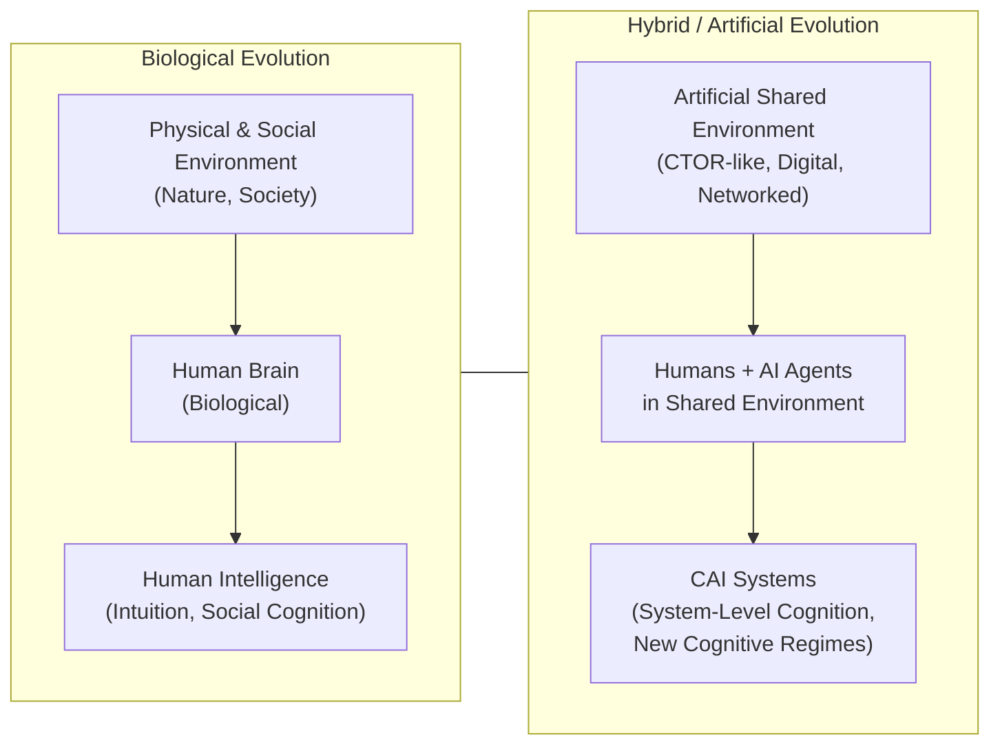

# CTOR‑Labs  
### Research Laboratory for Collective Intelligence, Hybrid Cognition, and CAI Systems

CTOR‑Labs is a research laboratory dedicated to studying **system-level intelligence** emerging in hybrid environments where humans and AI agents interact.  
We develop a new paradigm — **CAI Systems (Collective Artificial Intelligence Systems)** — and build experimental tools to validate it.

---

## 📌 Mission

Our mission is to investigate and formalize **new forms of intelligence** that arise:

- not in individual models,  
- not in individual humans,  
- but in **systems** where many agents interact within a shared environment.

We study:

- emergent cognitive regimes  
- collective intuition  
- hybrid forms of reasoning  
- system-level cognitive identity  

---
## 📌 Who Is CTOR For?

CTOR is designed as a universal research and educational platform for anyone exploring the future of intelligence beyond individual agents.

### 🎓 Students of AI & Machine Learning  
A hands‑on environment to study multi‑agent systems, emergent behavior, and hybrid cognition through real experiments.

### 👩‍🏫 Educators & Professors  
A ready‑to‑use platform for teaching:  
- collective intelligence  
- agent‑based modeling  
- human–AI collaboration  
- system‑level cognition

### 🧠 AI Researchers  
A controlled environment for testing hypotheses about:  
- emergent strategies  
- distributed attention  
- collective intuition  
- hybrid cognitive regimes

### 🧩 Developers & Engineers  
A modular, extensible system for building:  
- AI agents  
- analytics pipelines  
- multi‑agent architectures  
- experimental cognitive systems

### 🚀 Visionaries & Innovators  
A glimpse into the next evolutionary step of intelligence —  
not artificial, not biological, but **collective**.
## 📌 CAI Systems: A New Evolutionary Branch of Intelligence

### **Figure 1. Evolutionary Trajectory of Intelligence**

---
## Repository Structure
The full structure of the CTOR ecosystem is documented here:  
[docs/RepositoryStructure.md](docs/RepositoryStructure.md)

## 📌 Projects at a Glance

CTOR‑Labs maintains several structured research branches, each representing a distinct interaction regime inside the CTOR environment.

### 🤖 CTOR‑AI‑AI  
AI‑vs‑AI matches for studying emergent strategies, distributed attention, and system‑level cognition arising purely from artificial agents.  
👉 https://github.com/CTOR-Labs/CTOR-AI-AI

### 🧑‍🤝‍🧑 CTOR‑H-H  
Human‑vs‑Human matches inside CTOR, used as a baseline for comparing human strategic behavior, coordination, and intuition.  
👉 https://github.com/CTOR-Labs/CTOR-H-H

### 🧑‍🤖 CTOR‑H-AI  
Hybrid Human‑vs‑AI matches — the core experimental track for studying hybrid cognition, collective intuition, and emergent cooperation.  
👉 https://github.com/CTOR-Labs/CTOR-H-AI

### 🧩 CTOR‑TEAM‑TEAM  
Team‑vs‑Team configurations (2v2, 3v3, hybrid teams) for exploring group coherence, distributed roles, and system‑level identity.  
👉 https://github.com/CTOR-Labs/CTOR-TEAM-TEAM

# 🌐 Project Website

https://www.ctorgame.com

---

# 🤝 How to Contribute

## ⭐ Ambassador  
Spread the word, share materials, invite others.

## ⭐ Team Member  
CTO, CMO, Domain Leads.

## ⭐ Sponsor  
Support CTOR‑Labs
If you want to support the development of CTOR‑Labs, you can make a one‑time contribution via PayPal:
👉 https://paypal.me/CTORLabs

---

# 💼 Venture Participation/Investor

For venture‑level participation and company shares:  
https://www.linkedin.com/in/vladimir-bronnikov-51b1212/

